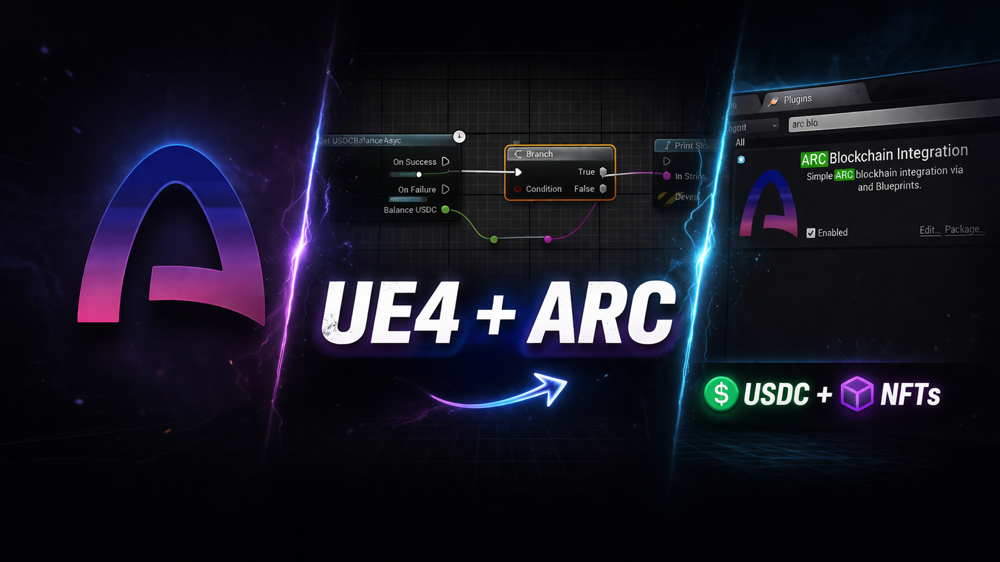

# Unreal Engine plugin for @Arc (USDC + NFTs)



An Unreal Engine plugin + Node.js backend that makes it easy to build **onchain** game flows on **@Arc** using familiar Blueprint nodes.

This project gives game developers:

- A reusable **Unreal Engine plugin** (`ArcBlockchain`) that:
  - Reads onchain data (e.g. **USDC balances**) directly from @Arc via JSON‑RPC.
  - Talks to a simple **backend API** for write operations (spending / rewarding USDC, minting NFTs, registering players).
  - Exposes everything as **Blueprint nodes**, so you don’t have to write C++ to integrate @Arc.

- A **reference backend** (Node.js + ethers v6 + Express) that:
  - Wraps your **GameCore** and **GameNFT** smart contracts behind simple HTTP endpoints.
  - Signs transactions with a server‑side wallet.
  - Provides a clear pattern for real game servers (authoritative logic, rewards, etc).

Out of the box, you get:

- `Get USDC Balance (Async)` – async Blueprint node to query a player’s USDC balance on @Arc.
- `Backend Register Player` – POST to backend → `GameCore.registerPlayer`.
- `Backend Pay With USDC` – POST to backend → `GameCore.payWithUSDC`.
- `Backend Reward USDC` – POST to backend → `GameCore.rewardUSDC`.
- `Backend Mint NFT` – POST to backend → `GameNFT.mintTo`.

All of these are designed to be **plug‑and‑play** for any @Arc game that wants:

- Server‑side control of state and rewards.
- Client‑side UX in Unreal, entirely through Blueprints.

---

## Docs

- [`SETUP.md`](./SETUP.md) – quick start using the deployed contract addresses in this repo.
- [`DOC.md`](./DOC.md) – detailed guide: architecture, customization, best practices.

---

## Repository Layout

Recommended structure:

```text
arc-unreal/
├─ blockchain/          # Hardhat/Foundry project with GameCore.sol, GameNFT.sol, deployments
├─ backend/             # Node.js + Express backend server (server.js, package.json, .env)
└─ UnrealProject/
   ├─ Plugins/
   │  └─ ArcBlockchain/ # Unreal plugin (C++ + Blueprint nodes)
   └─ Content/
      └─ ...            # Your game content (maps, blueprints, UI)
```

Key components:

- **`blockchain/contracts/GameCore.sol`**
  - Manages player profiles, USDC spends and rewards.
  - Interfaces with @Arc’s USDC token contract.
- **`blockchain/contracts/GameNFT.sol`**
  - Simple ERC‑721 contract for minting game NFTs to players.

- **`backend/server.js`**
  - Connects to @Arc via `ethers.JsonRpcProvider(ARC_RPC_URL)`.
  - Uses `PRIVATE_KEY` wallet to call `GameCore` and `GameNFT`.
  - Exposes routes:
    - `POST /registerPlayer`
    - `POST /payWithUSDC`
    - `POST /rewardUSDC`
    - `POST /mintNFT`
    - `GET /health`

- **`Plugins/ArcBlockchain` (Unreal plugin)**
  - `UArcBlockchainSettings` – holds RPC URL and GameCore address.
  - `UGetUSDCBalanceAsync` – async Blueprint node calling `eth_call` against `GameCore.getUSDCBalance`.
  - Blueprint‑callable functions for the backend routes (HTTP POSTs to your server).

---

## Who Is This For?

- **Unreal Engine developers** who want to add:
  - Onchain balances and items (USDC, NFTs) to their game.
  - Server‑authoritative rewards and payments.
  - @Arc integration with minimal blockchain boilerplate.

- **@Arc developers** who want:
  - A reference integration showing best practices for:
    - `ethers` + @Arc RPC
    - Smart contract design for games (`GameCore`, `GameNFT`)
    - Safer backend patterns: server wallet, approvals, etc.

---

## Quick Start

If you want to run this project **exactly as configured in this repo**, follow:

- [`SETUP.md`](./SETUP.md) – quick setup using the deployed contract addresses and config.
- [`DOC.md`](./DOC.md) – in‑depth documentation and guidance for customizing and extending.

High‑level steps:

1. Deploy `GameCore` and `GameNFT` to @Arc (or use the addresses provided in `SETUP.md`).
2. Configure and run the **backend** in WSL or Linux.
3. Install and enable the **ArcBlockchain** plugin in your Unreal project.
4. In Unreal:
   - Set @Arc settings (RPC URL, GameCore address).
   - Set backend base URL (WSL IP:port).
   - Use the Blueprint nodes in your map or game mode to:
     - Read USDC balances.
     - Register players.
     - Spend/reward USDC.
     - Mint NFTs.

---

## Security notes

- Do **not** commit secrets: never push `.env` files or private keys to GitHub.
- The backend signs transactions using `PRIVATE_KEY`. Run it on trusted infrastructure only.
- USDC uses **6 decimals**. Example: `5 USDC = 5,000,000` (raw units).

---

## Status

- ✅ Onchain read path: `GetUSDCBalanceAsync` (verified with real balances on @Arc testnet).
- ✅ Backend write path:
  - `registerPlayer`
  - `payWithUSDC`
  - `rewardUSDC`
  - `mintNFT`
- ✅ Unreal integration:
  - Blueprint nodes hooked to backend and onchain RPC.
  - Tested end‑to‑end with @Arc testnet.

Next steps you can take:

- Add async Blueprint nodes that wait for backend responses and expose `OnSuccess(TxHash)` / `OnFailure(Error)` events.
- Package this as a marketplace‑ready plugin.
- Publish video tutorials / screenshots (and link them here or in `DOC.md`).

---
## License

Apache-2.0 — see [`LICENSE`](./LICENSE).

> Note: Earlier versions of this repository may have been released under the MIT License. See Git history/tags for details.